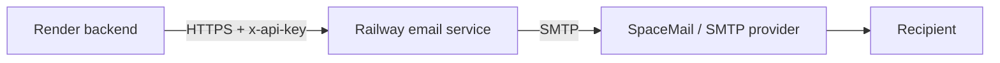

# Delivo Email Service

This microservice handles Delivo email delivery over SMTP and exposes a secure API for the Render backend.

## Architecture



## Endpoints

- POST /api/send-verification
- POST /api/send-password-reset
- POST /api/send-welcome

All endpoints require the `x-api-key` header.

## Security

- Every endpoint is protected by `x-api-key`.
- Requests are rate limited.
- No passwords or SMTP credentials are logged.

## Environment variables

- PORT
- NODE_ENV
- EMAIL_HOST
- EMAIL_PORT
- EMAIL_USER
- EMAIL_PASS
- EMAIL_FROM_NAME
- EMAIL_FROM_ADDRESS
- EMAIL_SERVICE_SECRET

## Deployment guide

1. Create a Railway project.
2. Deploy this folder as a Node.js service.
3. Add the variables above in Railway Settings > Environment.
4. Set `PORT` to `4000` or let Railway assign it.
5. Copy the Railway URL to the Render backend as `EMAIL_SERVICE_URL`.
6. Set the same shared secret in Render as `EMAIL_SERVICE_SECRET`.

## Testing

Use the included script:

```bash
chmod +x test-requests.sh
./test-requests.sh http://localhost:4000 replace-with-secret
```
